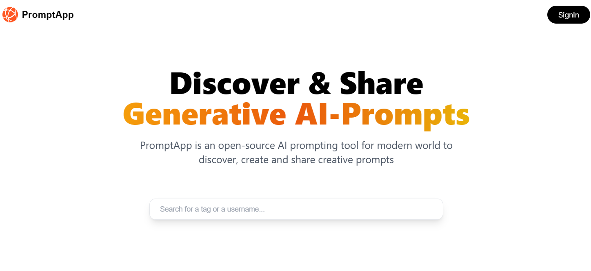

<div align="center">
  <br />
    <a href="https://youtu.be/oKIThIihv60" target="_blank">
      
    </a>
  <br />

  <div>
    
    
    
  </div>

   <h3 align="center">Share Prompt App</h3>
</div>

## 📋 <a name="table">Table of Contents</a>
1. 🤖 [Introduction](#introduction)
2. ⚙️ [Tech Stack](#tech-stack)
3. 📌 [Features](#features)
4. 🤸 [Quick Start](#quick-start)
5. 🔗 [Reference](#reference)
6. 🚀 [More](#more)


## <a name="introduction">🤖 Introduction</a>

Share prompt app is a simple web application based on Nextjs framework. With modern UI/UX web app, share prompt app has more features with signin, signup, create post and view profile user.

## <a name="tech-stack">⚙️ Tech Stack</a>

- Next.js 13.4
- NextAuth.js
- JavaScript
- Tailwind CSS
- MongoDB

## <a name="features">📌 Features</a>

- 👉 **SignIn Account**: Users can sign in to their accounts by using Google Authentication provider and gain access to the SharePromptApp features and functionalities.
- 👉 **SignOut Account**: Users have to sign out their account, terminating their session and ensuring their privacy and security information.
- 👉 **Search Post by tag**: 
- 👉 **Create Post, Edit Post and Delete Post**:
- 👉 **Copy Prompt**:
- 👉 **View Other Users ProfilePage**: 
- 👉 **Google Authentication using NextAuth**:
- 👉 **Responsive Layout Website**: 

## <a name="quick-start">🤸 Quick Start</a>

Follow step by step to set up the project locally on your device.

**Prerequisites** 

Make sure that you have the following installed dependencies:

- [Git](https://git-scm.com/)
- [Node.js](https://nodejs.org/en)
- [npm](https://www.npmjs.com/) (Node Package Manager)

**Clone this repository**

```bash
https://github.com/NguyenBao23131/Share-promptApp-Nextjs.git
cd share-prompt-ai
```

**Installation**

Install the project dependencies by using npm:

```bash
npm install
```
Create a new file named `.env` in the root of your project and add api key in the following content:

```env
GOOGLE_ID=""
GOOGLE_CLIENT_SECRET=""
MONGODB_URI=""

NEXTAUTH_URL="http://localhost:3000"
NEXTAUTH_URL_INTERNAL="http://localhost:3000"
NEXTAUTH_SECRET=
```
Caution

> Note:
- If you want to get key `GOOGLE_ID` and `GOOGLE_CLIENT_SECRET`, you should access the website [GoogleCloud](https://console.cloud.google.com/).
- To have `NEXTAUTH_SECRET` please access the website [https://www.cryptool.org](https://www.cryptool.org/en/cto/openssl) and type command line in terminal tool `openssl rand -base64 32` to generate random private key.
- To have `MONGODB_URI`, you can get a private key from my mongodb database.

**Running the Project**

```bash
npm run dev
```

Open [http://localhost:3000/](http://localhost:3000/) in your browser to view the project.

## <a name="reference">🔗 Reference</a>

- [Next.js](https://nextjs.org/) - learn about Next.js fullstack framework and API.
- [React.js](https://react.dev/) - learn about concepts and examples of React library.
- [NextAuth.js](https://next-auth.js.org/) - a library auth is available for developers.
- [JavaScript](https://developer.mozilla.org/en-US/docs/Web/javascript) - a programming language use for web developer.
- [TailWind-CSS](https://tailwindcss.com/) - a framework css is connivent to build style.
- [MongoDB](https://www.mongodb.com/) - a non-sql is easy to use and scale your database.

## <a name="more">🚀 More</a>

**Contact me**

- [Facebook](https://www.facebook.com/baonguyenno1412)
- [Fanpages](https://www.facebook.com/DevAnonitos/)
- [Instagram](https://www.instagram.com/devanonitos/)
- [Thread](https://www.threads.net/@devanonitos)
- [Twitter](https://twitter.com/BaoNo1144)

